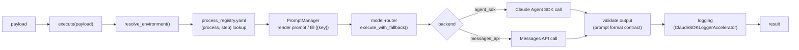
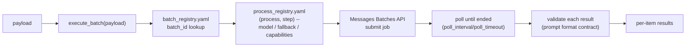

# Architecture

This project runs on the `claude-project-accelerator` stack:

1. `execute(payload)` (`project_accelerator`) resolves `environment`,
   looks up the `(process, step)` config from `process_registry.yaml`,
   calls the model via `claude-model-router-accelerator`'s ordered
   fallback chain, validates output against the prompt's format
   contract, and logs the turn.
2. `process_registry.yaml` is the single source of truth for step order
   and per-step `{prompt, model, fallback, ...capabilities}` config --
   see `.claude/rules/process-registry.md` for the schema and how extra
   keys (`max_turns`, `thinking`, `temperature`, ...) pass through to the
   model call untouched. **This is the model invocation layer** -- every
   detail of what runs (which prompt, which model, fallback order,
   per-call capability flags) lives here and nowhere else.
3. `prompts/*.yaml` holds the prompt templates the registry points at,
   including `{{key}}` placeholders rendered from `execute()`'s `input`.
   A later step can also reference an earlier step's result via
   `{{<stepName>_output}}` (e.g. `{{classify_output}}`) -- this name is
   generated mechanically from the step's key in `steps: [...]`, not
   declared in that step's own prompt YAML. See
   `.claude/rules/process-registry.md`'s "Threading a prior step's
   output" section.
4. Auth resolution (`claude-auth-accelerator`) and tracing
   (`ClaudeSDKLoggerAccelerator`) are wired in automatically -- nothing
   to configure to get logging or credential resolution working.
5. `batch_registry.yaml` is the batch-run counterpart -- it carries
   **only** batch-run mechanics (`batch_id`, which `process`/`step` to
   run, `environment`, poll timing). It has no model/prompt/fallback
   fields of its own; `execute_batch()` always looks those up from the
   `process_registry.yaml` step the batch entry points at. See
   `.claude/rules/batch-registry.md` for the schema.

## Request flow (text path)

## Batch flow

`batch_registry.yaml` never carries model info itself -- step D2 always
resolves back into `process_registry.yaml` for prompt/model/fallback/
capabilities, same as the text path.

See `docs/HOWTO.md` for a file-by-file breakdown and `README.md` for the
quick-start commands.
